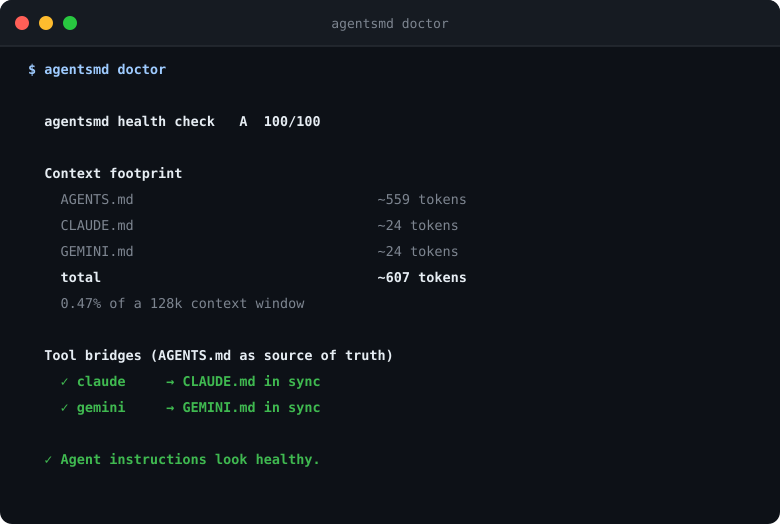

<div align="center">

**English** | [简体中文](README.zh-CN.md)

# agentsmd

**Your AI agent's instructions deserve CI.**

`agentsmd` is a single-binary toolkit that keeps `AGENTS.md` — and everything
built on it — honest: it **generates** a grounded AGENTS.md from your
repository's real toolchain, **validates** that every command and file it
mentions actually exists, **audits** quality and token cost, and **bridges**
Claude Code / Gemini CLI to it in one line.

[](https://github.com/youwei792/agentsmd/actions/workflows/ci.yml)
[](https://go.dev)
[](LICENSE)
[](#design-principles)



</div>

---

## Why this exists

Every serious repository now ships instructions for AI coding agents.
[AGENTS.md](https://agents.md) became the cross-tool standard under the Linux
Foundation — Codex, Cursor, Gemini CLI, Copilot, Jules, Amp and 30+ others
read it natively. But:

- **The file lies.** Someone changes `pnpm` to `npm`, renames a script, moves
  a file — and every agent in your team starts hallucinating from stale
  instructions. Nothing catches this, because AGENTS.md is *never executed*.
- **Claude Code doesn't read AGENTS.md.** It's the one holdout; it reads
  `CLAUDE.md`. Teams work around it with symlinks that break on Windows and
  confuse the tool, or hand-copy content that drifts within a week.
- **Nobody budgets tokens.** Your AGENTS.md is loaded into every single agent
  session. A bloated 6k-token file is a tax on every task, forever.

agentsmd treats agent instructions like code: **checked, measured, and kept
in sync automatically.**

## Install

```bash
# Go
go install github.com/youwei792/agentsmd@latest

# Homebrew (Linux too)
brew install youwei792/tap/agentsmd

# npm (global install)
npm install -g agentsmd

# Or grab a binary from Releases (linux/darwin/windows, amd64/arm64)
```

## Use

### 1. Generate a grounded AGENTS.md

```bash
agentsmd init
```

Not a template — agentsmd detects your package manager, scripts, Makefile
targets, frameworks, test runner, linters, monorepo layout and CI commands,
then writes only what it can prove. Anything it can't detect becomes an
explicit `TODO` for you.

### 2. Keep it truthful — in CI

```bash
agentsmd check
```

Parses your AGENTS.md (fenced blocks **and** inline backticks), extracts
commands and file references, and verifies them against reality: npm/pnpm/
yarn scripts, Makefile targets, just recipes, `go test ./...` paths, pytest
targets, compose files, requirements files, `./scripts/foo.sh`, dead file
links — with "closest match" hints (`pnpm testt` → did you mean `test`?).

Conservative by design: if it isn't sure something is broken, it stays
silent. Zero false alarms is the whole product.

Add it to CI with one step — the repo root is a [composite GitHub Action](action.yml):

```yaml
- uses: youwei792/agentsmd@v1
  with:
    strict: true
```

### 3. Audit quality with a score

```bash
agentsmd lint
```

Rules include: token bloat (with your context-window share), missing build/
test commands, dead references, package-manager mismatch (doc says `yarn`,
lockfile says `pnpm`), vague unfollowable rules, leftover TODOs, duplicate
sections, and staleness vs. your manifests. Scored A–F, CI-friendly exit codes.

### 4. Bridge Claude Code & Gemini CLI

```bash
agentsmd sync
```

Writes a one-line `@AGENTS.md` import into `CLAUDE.md`/`GEMINI.md` — the
approach Anthropic recommends — instead of symlinks. `--mode copy` and
`--mode symlink` exist; copy mode refuses to touch files it doesn't manage.
`agentsmd sync --check` fails CI when a bridge goes stale.

### 5. Know your context budget

```bash
agentsmd tokens
```

Sums the token cost of every agent instruction file the tools load and
shows what fraction of a 128k/200k/1M context window it eats.

### 6. All of it at once

```bash
agentsmd doctor
```

## Commands

| Command | What it does |
|---|---|
| `agentsmd init` | Generate a grounded AGENTS.md from detected facts (`--minimal`, `--force`, `--dry-run`) |
| `agentsmd check` | Verify every command/file reference exists (`--strict`, `--json`) |
| `agentsmd lint` | Quality audit + A–F score (`--json`) |
| `agentsmd tokens` | Context cost of agent files (`--json`) |
| `agentsmd sync` | Bridge CLAUDE.md/GEMINI.md to AGENTS.md (`--mode import\|copy\|symlink`, `--check`) |
| `agentsmd doctor` | Everything above in one report (`--json`) |
| `agentsmd skills` | Validate Agent Skills (`SKILL.md`) bundles — frontmatter rules, bundle integrity, token cost |
| `agentsmd org` | Fleet report: AGENTS.md health of every public repo of an org/user (requires `gh`) |
| `agentsmd analyze` | Show the detected toolchain facts (`--json`) |

Every command emits JSON with `--json`, so you can build your own dashboards.

## What it detects

Package managers (`packageManager` field + lockfiles), npm/pnpm/yarn/bun
workspaces, go.work, Cargo workspaces, package.json scripts, Makefile
targets, justfile recipes, Poetry/uv/pip setup, pytest/ruff/eslint/prettier/
biome/golangci-lint/clippy configs, 60+ frameworks from dependency manifests,
GitHub Actions & GitLab CI commands, Docker, and your existing agent files.

## Security posture

Agent instruction files are an attack surface: agents follow them
literally, and people paste credentials into them. `lint` therefore ships
security rules:

- **`SECRETS-FOUND`** — live API keys, GitHub/Slack tokens, AWS key ids and
  private-key blocks documented in your instructions (placeholder values
  like `sk-xxx…` and the AWS `…EXAMPLE` convention stay silent).
- **`RISKY-COMMAND`** — `curl … | sh`, `sudo`, `eval`, `chmod 777`,
  `rm -rf ~` documented as things agents should run.

And the tool itself is designed to be safe to run anywhere:

- **Never executes** the commands it reads — parsing and `os.Stat` only.
- **Fully offline** (except `org`, which shells out to the `gh` CLI).
- **Zero dependencies**, no telemetry, checkout-only inspection — refs
  that escape the repo root are never read.
- **Checksummed releases**: the GitHub Action verifies `checksums.txt`
  before running the binary.

Details and reporting: [SECURITY.md](SECURITY.md). Public accuracy
evidence: [docs/benchmarks.md](docs/benchmarks.md).

## Design principles

1. **Conservative or silent.** A checker that cries wolf gets uninstalled.
   Findings must be provably right. The engine was validated against real
   production AGENTS.md files (see [docs/benchmarks.md](docs/benchmarks.md)):
   ~555 references across 8 real repos, every early finding triaged by
   hand, eight false-positive classes fixed in v0.1.1 with regression
   tests.
2. **Grounded generation.** `init` writes only commands it found in your
   repo. It never invents a `make test` that doesn't exist.
3. **Zero dependencies.** Pure stdlib Go (~5k LOC). `go build` is the whole
   supply chain. Security teams can read every line in an afternoon.
4. **CI-first.** Exit codes and `--json` everywhere; the repo root *is* the
   GitHub Action.
5. **Your files are yours.** `sync` in copy mode refuses to touch unmanaged
   files. `init` backs up before replacing.

## The symlink problem

The popular fix for Claude Code is `ln -s AGENTS.md CLAUDE.md`. It works
until it doesn't: Windows checkouts without developer mode materialize
symlinks as copies (instant drift), some tools read them twice or get
confused, and git symlinks on Windows need extra config. agentsmd's default
import mode is a plain three-line file any tool can read:

```markdown
<!-- managed by agentsmd: this file bridges to AGENTS.md. Edit AGENTS.md instead. -->

@AGENTS.md
```

## This repo eats its own dog food

The `dogfood` CI job runs `agentsmd check .` on this repository's AGENTS.md
on every push — `doctor` scores it 100/100. If a documented command ever
breaks, CI goes red before an agent notices.

## Roadmap

- [x] `agentsmd skills` — lint SKILL.md agent skills (v0.2.0)
- [x] Org mode: `agentsmd org <gh-org>` health report across repositories (v0.2.0)
- [ ] `--fix` for safe auto-repairs (dead links → closest match)
- [ ] Pre-commit hook: check on manifest changes
- [x] npm distribution (esbuild-style platform packages; `scripts/build-npm.sh 0.2.0` assembles them — publishing pending npm credentials)

PRs welcome — see [CONTRIBUTING.md](CONTRIBUTING.md).

## License

[MIT](LICENSE) © youwei792
